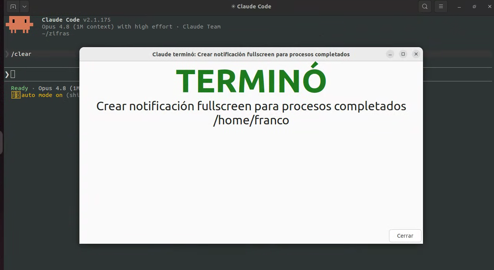

# Notificaciones para Claude Code y Codex

Este repo contiene una guía para configurar avisos de escritorio cuando Claude Code o Codex terminan de trabajar y vuelve a ser tu turno.

La idea es simple: después de cada turno aparece una ventana o notificación y suena un aviso. Sirve para dejar a la IA trabajando sin tener que mirar la terminal todo el tiempo.

## Qué hace

- Configura hooks de finalización para Claude Code y Codex.
- Muestra un popup cuando la herramienta termina o necesita atención.
- Reproduce un sonido usando los sonidos del sistema.
- Permite elegir entre cuatro modos: ventana con OK, banner grande centrado, notificación persistente o notificación transitoria.
- En Claude, el aviso de "espera input tras estar ocioso" (`idle_prompt`) viene **apagado por defecto** porque se dispara seguido y molesta; se puede activar como notificación transitoria (o heredando el modo general) con la variable `IDLE_MODE`.
- Deja scripts separados para Claude Code y Codex, porque cada herramienta entrega datos distintos al hook.

## Modo banner

El modo `banner` muestra una ventana grande centrada en pantalla, con un titular enorme y color, que queda abierta hasta que la cerrás. Está pensado para verse de lejos desde otro monitor: no es una notificación chica en la esquina, es un cartel imposible de ignorar.

El color y el texto cambian según el evento:

- Verde **TERMINÓ**: la herramienta terminó el turno y es tu turno.
- Naranja **PIDE PERMISO**: hay una autorización pendiente.
- Naranja **ESPERA INPUT**: hay una pregunta o revisión pendiente. En Claude este aviso (`idle_prompt`) está apagado por defecto; para verlo en banner hay que poner `IDLE_MODE="inherit"` con `MODE="banner"`.

Usa `yad` para dibujar la ventana. Si `yad` no está instalado, el script cae a `zenity`. Podés ajustar el tamaño con `BANNER_WIDTH` / `BANNER_HEIGHT` y los tamaños de letra dentro del script. Para activarlo, poné `MODE="banner"` en el hook.

## Para quién es

Para usuarios de Linux con escritorio que usan Claude Code, Codex o ambos, y quieren recibir una señal clara cuando la IA termina un turno largo, pide permiso o queda esperando input.

## Requisitos

La guía está pensada para Linux con entorno gráfico. Usa herramientas comunes como `zenity`, `notify-send`, `jq`, `paplay` o `pw-play`, y sonidos del tema Freedesktop. El modo banner además necesita `yad`.

El Markdown incluye comandos de verificación antes de instalar paquetes, para evitar instalar cosas que ya están disponibles.

## Cómo usarlo

Si querés que una IA lo instale por vos, pasale este archivo:

[instalar-notificaciones-claude-codex.md](./instalar-notificaciones-claude-codex.md)

Ese documento está escrito como una receta operativa para agentes: incluye los comandos, las decisiones que debe preguntarte y los detalles de configuración para cada herramienta.

Si preferís hacerlo manualmente, podés seguir el mismo Markdown paso a paso.

## Contenido

- `README.md`: explicación humana del proyecto.
- `instalar-notificaciones-claude-codex.md`: guía de instalación detallada, pensada para que una IA pueda ejecutarla o adaptarla en otra computadora.
- `parche-idle-apagado.md`: parche para instalaciones previas, que actualiza el script de Claude para que el aviso `idle_prompt` no notifique por defecto. Incluye cuándo aplicarlo y por qué.
