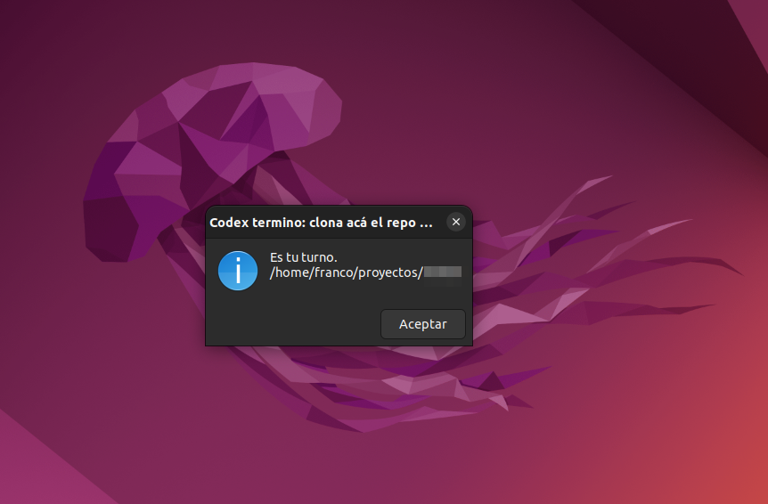

# Notificaciones para Claude Code y Codex

Este repo contiene una guia para configurar avisos de escritorio cuando Claude Code o Codex terminan de trabajar y vuelve a ser tu turno.

La idea es simple: despues de cada turno aparece una ventana o notificacion y suena un aviso. Sirve para dejar a la IA trabajando sin tener que mirar la terminal todo el tiempo.

## Que hace

- Configura hooks de finalizacion para Claude Code y Codex.
- Muestra un popup cuando la herramienta termina o necesita atencion.
- Reproduce un sonido usando los sonidos del sistema.
- Permite elegir entre tres modos: ventana con OK, notificacion persistente o notificacion transitoria.
- Deja scripts separados para Claude Code y Codex, porque cada herramienta entrega datos distintos al hook.

## Para quien es

Para usuarios de Linux con escritorio que usan Claude Code, Codex o ambos, y quieren recibir una senal clara cuando la IA termina un turno largo, pide permiso o queda esperando input.

## Requisitos

La guia esta pensada para Linux con entorno grafico. Usa herramientas comunes como `zenity`, `notify-send`, `jq`, `paplay` o `pw-play`, y sonidos del tema Freedesktop.

El Markdown incluye comandos de verificacion antes de instalar paquetes, para evitar instalar cosas que ya estan disponibles.

## Como usarlo

Si queres que una IA lo instale por vos, pasale este archivo:

[instalar-notificaciones-claude-codex.md](./instalar-notificaciones-claude-codex.md)

Ese documento esta escrito como una receta operativa para agentes: incluye los comandos, las decisiones que debe preguntarte y los detalles de configuracion para cada herramienta.

Si preferis hacerlo manualmente, podes seguir el mismo Markdown paso a paso.

## Contenido

- `README.md`: explicacion humana del proyecto.
- `instalar-notificaciones-claude-codex.md`: guia de instalacion detallada, pensada para que una IA pueda ejecutarla o adaptarla en otra computadora.
